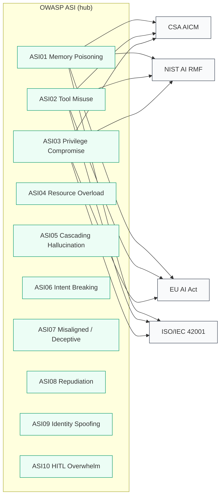

# ARGOS Methodology

ARGOS organises the audit of agentic AI systems around a single, explicit
assumption: **every finding must be traceable to a normative control in at
least three regulatory or standards frameworks**. Without that traceability,
an audit is an opinion; with it, it is evidence.

## The compliance graph

OWASP ASI is the hub. Every finding is first categorised into one of the ten
agentic threat categories; the mapping then projects that finding into the
obligations of four other frameworks.



Only three ASI categories are shown above for clarity; the actual mapping
covers ASI01--ASI10 and links into every framework. The full machine-readable
version lives in `packages/argos-core/src/argos_core/compliance/data/mapping.yaml`.

## Risk attribution: CBRA

Raw severity (Critical / High / Medium / Low) is necessary but not sufficient:
a Critical finding in an L0 assistive agent is less urgent than a Medium
finding in an L5 autonomous agent. ARGOS therefore ranks findings with the
**Capability-Based Risk Attribution** (CBRA) score.

### Inputs

| Variable         | Range     | Meaning                                                    |
| ---------------- | --------- | ---------------------------------------------------------- |
| `autonomy`       | L0--L5    | CSA autonomy level of the audited agent                    |
| `exposure`       | `[0, 1]`  | Fraction of untrusted input that reaches tool calls        |
| `blast_radius`   | `[0, 1]`  | Normalised severity of the worst plausible action          |
| `reversibility`  | `[0, 1]`  | Probability that a harmful action is reversible            |

### Formula

```
w = weight(autonomy)        # L0=0.10, L1=0.25, L2=0.50, L3=0.75, L4=0.90, L5=1.00
raw = w * (0.5 * exposure + 0.5 * blast_radius) * (1 - 0.5 * reversibility)
cbra = clamp(raw, 0, 1)
```

The weights are empirical and will be calibrated against the Module 7
validation scenarios. Their rationale is documented in
`docs-internal/RFCs/0002-compliance-data.md`.

### Worked example

An L3 autonomous agent with 80% of its tool inputs coming from untrusted
web content, a high-impact action (payment capability, blast_radius = 0.9),
and weak reversibility (0.2) scores:

```
w = 0.75
raw = 0.75 * (0.5 * 0.8 + 0.5 * 0.9) * (1 - 0.5 * 0.2)
    = 0.75 * 0.85 * 0.9
    = 0.574
```

CBRA 0.574 places that agent well above the 0.3 threshold we recommend for
requiring human-in-the-loop on every action outside a read-only scope.

## Evidence discipline

```mermaid
flowchart LR
    A[producer: scanner / red-team / proxy] -->|yields| B[Finding]
    B -->|requires| C[Evidence<br/>path | request/response | trace-id]
    B -->|references| D[compliance_refs<br/>owasp_asi:ASI01 + ...]
    C --> E[report.html]
    D --> E
    E -->|renders| F[compliance matrix<br/>per-framework coverage]

    classDef node fill:#f9fafb,stroke:#374151,stroke-width:1px;
    classDef out fill:#ecfdf5,stroke:#059669,stroke-width:1px;
    class A,B,C,D node;
    class E,F out;
```

A finding without `Evidence` is rejected by the Pydantic model at
construction time. A finding that cites no `compliance_refs` is rendered in
the report with a warning and excluded from the compliance matrix --
forcing the auditor to decide whether the finding is genuinely out of scope
for the regulatory frameworks or simply un-mapped.

## Where each framework contributes

| Framework      | What ARGOS uses it for                                                   |
| -------------- | ------------------------------------------------------------------------ |
| OWASP ASI      | Threat taxonomy; canonical category for each finding.                    |
| CSA AICM       | Implementation controls; concrete engineering checklist for a finding.   |
| NIST AI RMF    | Programmatic guidance (GOVERN / MAP / MEASURE / MANAGE) per audit task.  |
| EU AI Act      | Normative obligations and the evidence that Article 11 / Annex IV ask.   |
| ISO/IEC 42001  | Management-system framing -- which team owns what, with what cadence.    |

## Integrity invariants (enforced by CI)

`packages/argos-core/tests/test_compliance_integrity.py` encodes the
promises above as fail-hard tests. They run in every CI pipeline:

- Every ASI top-level category has >= 3 cross-framework controls.
- Every ASI top-level category is reachable in at least 4 non-hub frameworks.
- Every mapping reference resolves to a real control.
- Every `parent_id` points at an existing control within the same framework.
- Control ids are unique per framework.
- The mapping hub is declared as `owasp_asi` and every ASI top-level is covered.
